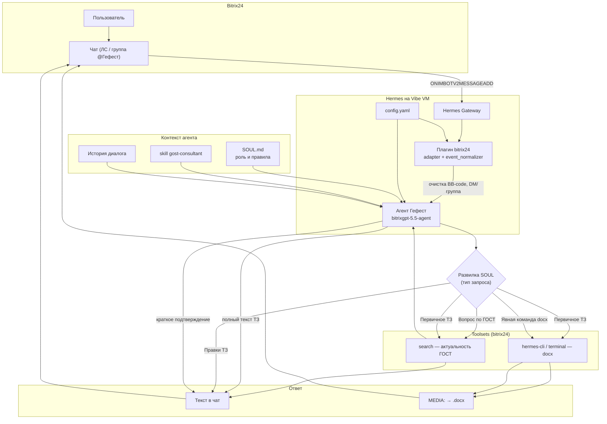

# Гефест — Hermes-агент для Bitrix24

Инженерный чат-бот на платформе **Hermes (Vibe VM)**: генерация ТЗ, консультации по ЕСКД / ЕСПД / ОКР с проверкой актуальности ГОСТ через поиск.

## Архитектура



> **Важно:** отдельного роутера в коде нет. `SOUL.md` и skill задают поведение через системный промпт; модель выбирает ветку по тексту запроса и истории диалога.

## Развилка SOUL — режимы вывода

| Ситуация | Пример запроса | В чат | Docx |
|----------|----------------|-------|------|
| Консультация по ГОСТ | «Какой ГОСТ для ТЗ на ОКР?» | ответ + статус стандарта | — |
| **Первичная генерация ТЗ** | «Сформируй ТЗ» + описание | **полный текст ТЗ** | **да, сразу** |
| **Правки** | «переделай», «внеси изменения», «исправь раздел 3» | **актуальный текст** (полный или фрагменты) | **нет** |
| **Docx по команде** | «пришли docx», «выгрузи в word» | краткое подтверждение | **да** |

## Поток сообщения (упрощённо)

```
Пользователь B24
    → Hermes Gateway
    → event_normalizer (BB-code [USER=…] → plain text)
    → Агент (SOUL + skill + config + история)
    → [развилка SOUL]
         ├─ ГОСТ     → search → текст
         ├─ ТЗ (1-е) → search + terminal → текст + docx
         ├─ Правки   → текст
         └─ «docx»   → terminal → docx
    → message_sender + outbound_media (MEDIA:)
    → Ответ в Bitrix24
```

## Структура репозитория

| Путь | Назначение |
|------|------------|
| `SOUL.md` | Системный промпт, роль «Гефест», развилка режимов |
| `config-patch.yaml` | Фрагмент для merge в `/opt/hermes/data/config.yaml` |
| `tz-structure-*.md` | Структуры ТЗ по профилям документа |
| `skills/gost-consultant/` | Skill: ГОСТ, структура ТЗ, references |
| `scripts/generate_tz_docx.py` | Генерация `.docx` (python-docx) |
| `scripts/deploy-to-vm.ps1` | Деплой артефактов на Vibe VM |
| `scripts/patch-bitrix24-*.py` | Патчи плагина B24 (группы, BB-code, env) |

## На VM (типовые пути)

| Путь | Содержимое |
|------|------------|
| `/root/.hermes/SOUL.md` | Промпт агента |
| `/root/.hermes/skills/gost-consultant/` | Skill |
| `/opt/hermes/data/config.yaml` | Модель, toolsets, `direct_messages_only: false` |
| `/opt/hermes/platforms/bitrix24/` | Плагин Bitrix24 (после патчей) |
| `/root/.hermes/knowledge/generate_tz_docx.py` | Скрипт docx |

## Toolsets

```yaml
platform_toolsets:
  bitrix24:
    - search      # проверка ГОСТ в интернете
    - hermes-cli  # terminal для generate_tz_docx.py
```

## Профили ТЗ

| Профиль | Файл |
|---------|------|
| `okr_product` | `tz-structure-okr-product.md` |
| `okr_software` | `tz-structure-okr-software.md` |
| `okr_mixed_product` | `tz-structure-okr-mixed-product.md` |
| `standalone_software` | `tz-structure-standalone-software.md` |
| `standalone_hardware` | `tz-structure-standalone-hardware.md` |
| `as_system` | `tz-structure-as-system.md` |
| `custom` | `tz-structure-custom.md` |

## Docx

1. Агент пишет тело ТЗ в `/tmp/tz_body.txt` через **terminal**.
2. Запускает `generate_tz_docx.py`.
3. В конце ответа: `MEDIA: /tmp/tz_output.docx` — Bitrix24 прикрепляет файл автоматически.

## Деплой

```powershell
$env:VIBE_MAINTENANCE_KEY = "<ключ>"
.\scripts\deploy-to-vm.ps1
```

После деплоя патчи плагина B24 применять отдельно (сбрасываются при redeploy Hermes):

```bash
python3 /tmp/patch-bitrix24-group-chat-v2.py
python3 /tmp/patch-bitrix24-sanitize-text.py
python3 /tmp/patch-config-hermes-cli.py
systemctl restart hermes
```
